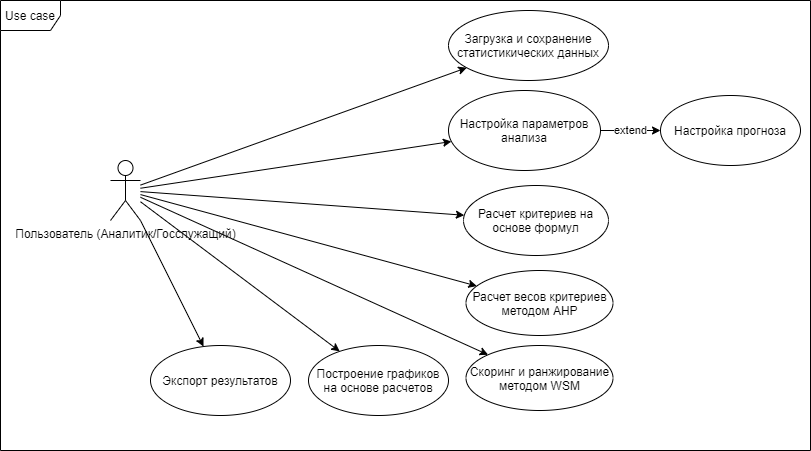

# 1. Перечень заинтересованных лиц (стейкхолдеров)

| Стейкхолдер | Краткое описание и интересы |
| :--- | :--- |
| Минпромторг России | Заинтересован в системе, как инструменте для поддержки принятия решений по финансированию отечественного производства конкретных категорий товаров из классификатора ТН ВЭД. |
| Различные фонды: Фонд развития промышленности, Фонд содействия инновациям | Заинтересованы в системе с точки зрения поиска самой выгодной отрасли для инвестирования. |
| Пользователь системы | Заинтересован в удобном и простом процессе использования системы. |
| Враги (Запад) | Внешние стейкхолдеры. Их интерес в ухудшении экономической ситуации в стране и косвенно это может повлиять на их противодействие внедрению подобных систем. |

# 2. Перечень функциональных требований

*   **FR-CMS-1:** Программа должна загружать статистику внешнеэкономической деятельности из открытых источников и сохранять её.
*   **FR-CMS-2:** Программа должна строить прогноз данных импорта на будущие периоды.
*   **FR-CMS-3:** Программа должна рассчитывать налоговые поступления от импорта по категориям товаров из ТН ВЭД.
*   **FR-CMS-4:** Программа должна рассчитывать налоговые поступления от локального производства товаров по категориям товаров из ТН ВЭД.
*   **FR-CMS-5:** Программа должна строить графики на основе рассчитанных данных.
*   **FR-CMS-6:** Программа должна показывать самые выгодные товары для импортозамещения.
*   **FR-CMS-7:** Программа должна предоставлять возможность авторизации.

# 3. Диаграмма использования

`.)

# 4. Перечень сделанных предположений

Система собственная, поэтому предположений нет.

# 5. Перечень нефункциональных требований

## 1. Производительность:
*   **NR-PERF-1:** Время отклика системы для любого пользовательского действия не должно превышать 2 секунд при средней нагрузке.

## 2. Надежность и доступность:
*   **NR-REL-1:** Система не должна аварийно завершать свою работу.

## 3. Безопасность:
*   **NR-SEC-1:** Логины и пароли для авторизации должны храниться в зашифрованном виде.
*   **NR-SEC-2:** Неавторизованный пользователь не должен иметь доступа к функционалу системы.

## 4. Удобство использования (Usability):
*   **NR-USA-1:** Интерфейс системы должен быть интуитивно понятным и требовать минимального обучения.

## 5. Сопровождаемость:
*   **NR-MAIN-1:** Система должна быть построена с использованием стандартных технологий и иметь полную техническую документацию для облегчения поддержки и дальнейшего развития.
