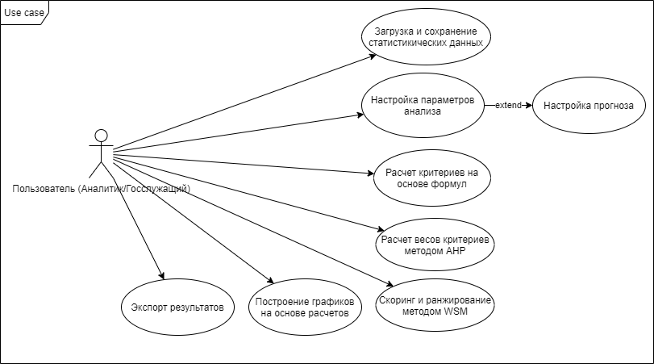

# Лабораторная работа №1
**Тема:** Формулирование требований к программной системе

# 1. Перечень заинтересованных лиц (стейкхолдеров)

| Стейкхолдер | Краткое описание и интересы |
| :--- | :--- |
| Минпромторг России | Заинтересован в системе как инструменте поддержки принятия решений при формировании политики импортозамещения и распределении мер господдержки. |
| Фонды развития (ФРП, ФСИ и др.) | Используют систему для определения перспективных направлений инвестирования и оценки эффективности вложений. |
| Промышленные предприятия и отраслевые союзы | Заинтересованы в выявлении перспективных товарных категорий для локализации производства и получения обоснований для участия в программах поддержки. |
| Аналитики и экономисты | Непосредственные пользователи системы. Проводят анализ данных, интерпретируют результаты и формируют рекомендации. |
| Пользователь системы | Заинтересован в удобстве, наглядности и корректности результатов анализа. |
| Внешние экономические акторы | Косвенно заинтересованы в результатах, так как приоритизация импортозамещения может повлиять на структуру рынка. |

# 2. Перечень функциональных требований

## 2.1 Работа с данными
- **FR-1:** Система должна обеспечивать загрузку данных внешнеэкономической деятельности из файлов формата CSV и Excel.
- **FR-2:** Система должна сохранять загруженные данные в структурированном виде для последующей обработки.
- **FR-3:** Система должна выполнять предобработку данных (агрегация, очистка, заполнение пропусков).

## 2.2 Расчёт аналитических показателей
- **FR-4:** Система должна рассчитывать долю импорта товара в общем объёме импорта.
- **FR-5:** Система должна рассчитывать темпы роста импорта.
- **FR-6:** Система должна рассчитывать показатель зависимости от импорта (отношение импорта к сумме импорта и экспорта).
- **FR-7:** Система должна рассчитывать индекс концентрации (HHI).
- **FR-8:** Система должна рассчитывать волатильность показателей на основе временных рядов.

## 2.3 Обработка критериев
- **FR-9:** Система должна выполнять клиппинг значений критериев для устранения выбросов.
- **FR-10:** Система должна выполнять нормализацию критериев для приведения к сопоставимому масштабу.

## 2.4 Определение весов критериев
- **FR-11:** Система должна обеспечивать определение весов критериев с использованием метода анализа иерархий (AHP).
- **FR-12:** Система должна предоставлять пользователю возможность ручной настройки весов критериев.

## 2.5 Многокритериальный анализ
- **FR-13:** Система должна рассчитывать интегральный показатель (скоринг) товаров на основе взвешенной суммы критериев.
- **FR-14:** Система должна выполнять ранжирование товаров по степени приоритетности для импортозамещения.

## 2.6 Визуализация и представление результатов
- **FR-15:** Система должна строить графики и диаграммы на основе рассчитанных данных.
- **FR-16:** Система должна отображать список наиболее приоритетных товаров для импортозамещения.

## 2.7 Прогнозирование
- **FR-17:** Система должна строить прогноз значений импорта на будущие периоды на основе исторических данных.

## 2.8 Экспорт результатов
- **FR-18:** Система должна обеспечивать экспорт результатов анализа (таблицы, графики) в формат Excel.

# 3. Диаграмма вариантов использования

# 4. Перечень сделанных предположений

## Данные
- Данные ВЭД доступны в формате CSV/Excel и корректно структурированы.
- Классификация товаров по ТН ВЭД остаётся стабильной во времени.

## Аналитическая модель
- Выбранные критерии адекватно отражают значимость импортозамещения.
- Критерии являются независимыми или слабо коррелированными.

## Прогнозирование
- Прогноз строится только на основе исторических данных.
- Внешние факторы не учитываются явно.

## Пользователи
- Пользователь обладает базовыми знаниями в области экономики и анализа данных.
- Система используется как инструмент поддержки принятия решений.

## Технические ограничения
- Система работает локально (desktop-приложение).
- Объём данных ограничен возможностями пользовательского устройства.

# 5. Перечень нефункциональных требований

## 5.1 Производительность
- **NFR-PERF-1:** Время отклика интерфейса не должно превышать 2 секунд.
- **NFR-PERF-2:** Время расчёта — не более 10 секунд для 10 000 записей.

## 5.2 Надёжность
- **NFR-REL-1:** Корректная обработка ошибок входных данных.
- **NFR-REL-2:** Отсутствие аварийных завершений.

## 5.3 Безопасность
- **NFR-SEC-1:** Данные хранятся локально.

## 5.4 Удобство использования
- **NFR-USA-1:** Все ключевые действия доступны с главного экрана.

## 5.5 Сопровождаемость
- **NFR-MAIN-1:** Модульная архитектура.
- **NFR-MAIN-2:** Документированный код.

## 5.6 Воспроизводимость
- **NFR-REP-1:** Одинаковые результаты при одинаковых данных.
