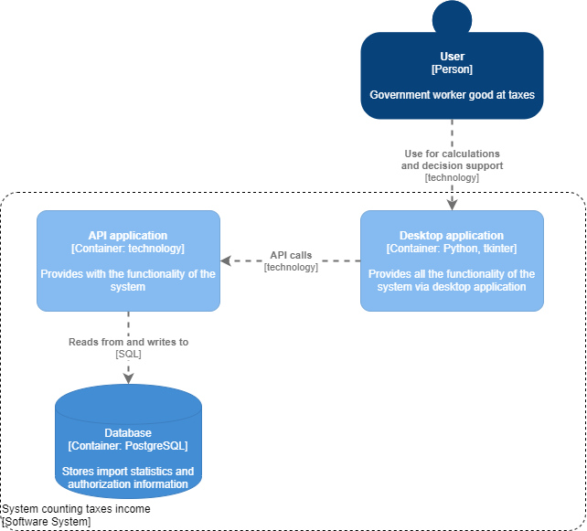
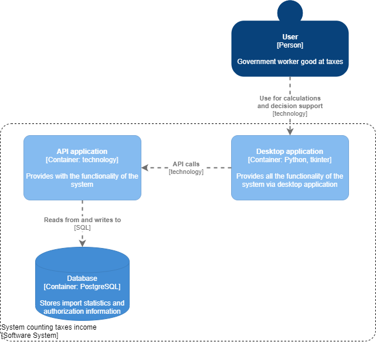
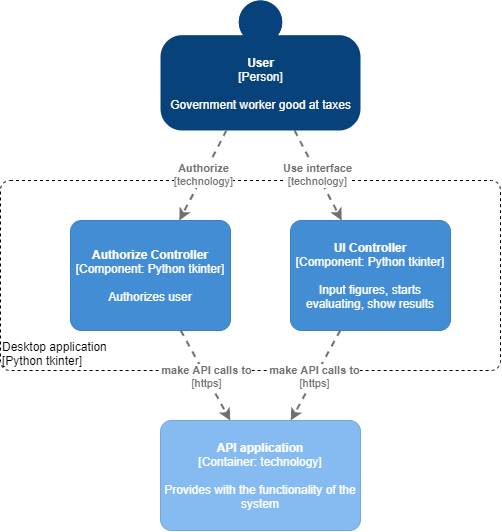
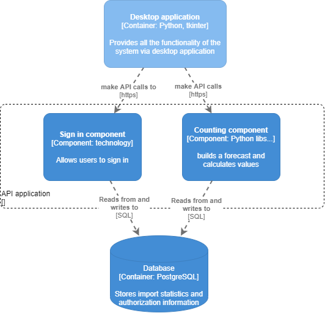

# Лабораторная работа №2

**Тема:** Использование нотации C4 model для проектирования архитектуры программной системы

**Цель работы:** Получить опыт использования графической нотации для фиксации архитектурных решений.

## Диаграмма системного контекста

Пользователь, разбирающийся в налогообложении, использует систему для аналитических вычислений и поддержки в принятии решении по выбору приоритетной отрасли импортозамещения

## Диаграмма контейнеров

Система состоит из настольного приложения и API приложения для вычислений и авторизации с сервера, который обращается к базе данных.

## Диаграмма компонентов (2 шт.)

Настольное приложение разделяется на компоненты авторизации и пользовательского интерфейса.
