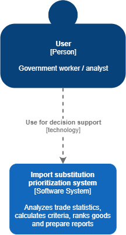
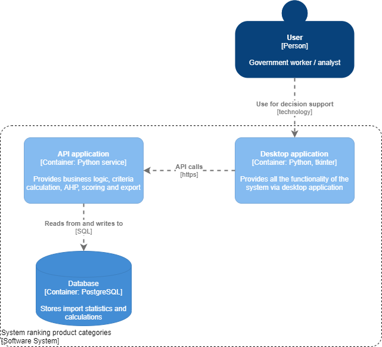
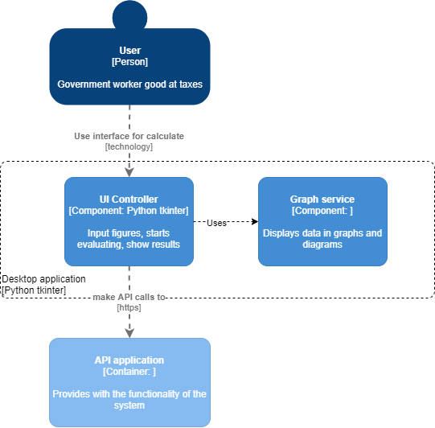
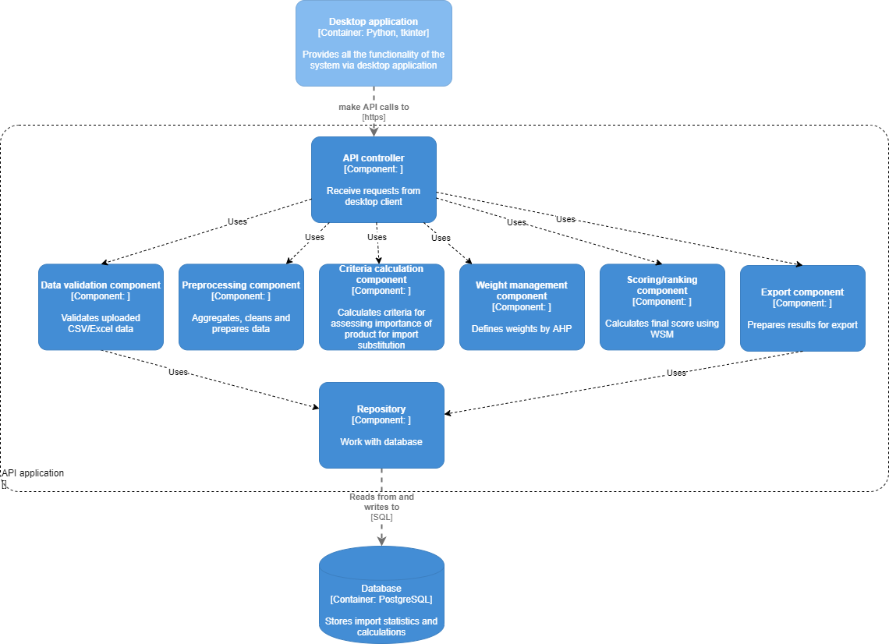

# Лабораторная работа №2

**Тема:** Использование нотации C4 model для проектирования архитектуры программной системы

**Цель работы:** Получить опыт использования графической нотации для фиксации архитектурных решений.

## Диаграмма системного контекста

Пользователь использует систему для поддержки в принятии решений по выбору приоритетной отрасли импортозамещения. Аритектура клиент-серверная.

## Диаграмма контейнеров

Система состоит из настольного приложения и API приложения для вычислений, которое обращается к базе данных.

## Диаграмма компонентов (2 шт.)

Components

- API / Request Handler

- Data Validation Component

- Preprocessing Component

- Criteria Calculation Component

- AHP Weighting Component

- Scoring & Ranking Component

- Result Export Component
