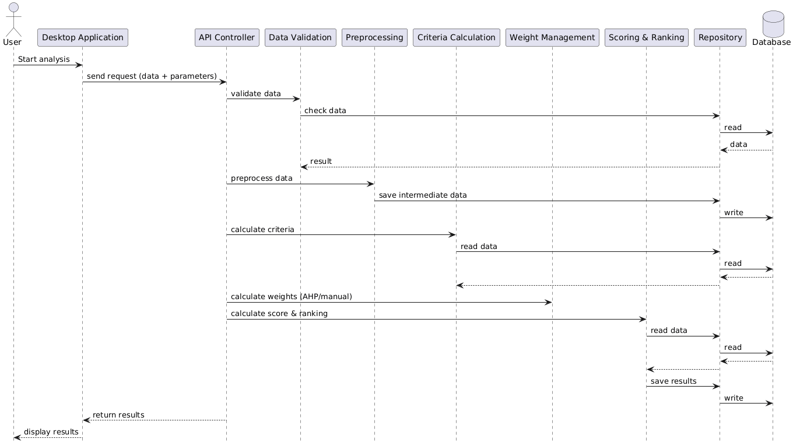
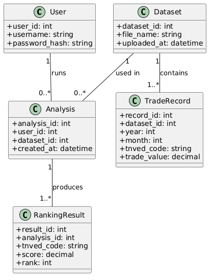

# Лабораторная работа №2

**Тема:** Использование нотации C4 model для проектирования архитектуры программной системы

**Цель работы:** Получить опыт использования графической нотации для фиксации архитектурных решений.

## 1 Диаграмма контейнеров и компонентов


## 2 Диаграмма последовательностей


Диаграмма последовательностей отражает процесс выполнения сценария «Проведение анализа импортозамещения». Пользователь инициирует выполнение анализа через desktop-приложение, которое отправляет запрос в серверную часть системы (API controller).

Далее API controller последовательно вызывает компоненты системы. Сначала выполняется валидация данных, затем предобработка, после чего производится расчёт критериев. Для получения и сохранения данных используется компонент Repository, который взаимодействует с базой данных.

После расчёта критериев выполняется определение весов (методом AHP или вручную), а затем осуществляется расчёт итогового скоринга и ранжирование товаров. Результаты сохраняются в базе данных и возвращаются в клиентское приложение, где отображаются пользователю.

Таким образом, диаграмма демонстрирует последовательное взаимодействие компонентов системы и отражает логику обработки данных от пользовательского запроса до получения результата.

## 3 Модель БД


Модель базы данных включает пять основных сущностей, необходимых для работы системы.

Сущность User хранит информацию о пользователях системы.
Сущность Dataset описывает загруженные наборы данных.
Сущность TradeRecord содержит отдельные записи статистики внешнеэкономической деятельности.

Сущность Analysis представляет собой запуск анализа, связывая пользователя и выбранный набор данных.
Сущность RankingResult хранит итоговые результаты анализа — рассчитанный скоринг и позицию товара в ранжированном списке.

# 4 Применение основных принципов разработки

## 4.1 KISS (Keep It Simple, Stupid)

```python
class ScoreCalculator:
    def calculate_score(self, criteria: dict, weights: dict) -> float:
        score = 0.0
        for key in criteria:
            score += criteria[key] * weights.get(key, 0)
        return score
```

**Пояснение:**
Реализация максимально простая: используется базовая формула взвешенной суммы без лишних усложнений. Код легко читается и проверяется, что соответствует принципу KISS.

---

## 4.2 DRY (Don’t Repeat Yourself)

```python
class Repository:
    def __init__(self, db):
        self.db = db

    def execute_query(self, query: str, params=None):
        cursor = self.db.cursor()
        cursor.execute(query, params or ())
        return cursor.fetchall()
```

```python
class TradeService:
    def __init__(self, repo: Repository):
        self.repo = repo

    def get_records(self):
        return self.repo.execute_query("SELECT * FROM trade_records")
```

```python
class AnalysisService:
    def __init__(self, repo: Repository):
        self.repo = repo

    def save_result(self, tnved, score):
        self.repo.execute_query(
            "INSERT INTO ranking (tnved, score) VALUES (%s, %s)",
            (tnved, score)
        )
```

**Пояснение:**
Логика работы с базой данных вынесена в единый класс Repository, что устраняет дублирование кода и соответствует принципу DRY.

---

## 4.3 YAGNI (You Aren’t Gonna Need It)

```python
class ForecastService:
    def forecast(self, values: list[float]) -> float:
        return sum(values) / len(values)
```

**Пояснение:**
Используется простая модель прогноза (среднее значение), без внедрения сложных алгоритмов. Это соответствует принципу YAGNI — реализуется только необходимая функциональность.

---

## 4.4 SOLID

### S — Single Responsibility Principle

```python
class DataValidator:
    def validate(self, data):
        if not data:
            raise ValueError("Empty dataset")
```

```python
class Preprocessor:
    def preprocess(self, data):
        return [x for x in data if x is not None]
```

**Пояснение:**
Каждый класс выполняет только одну задачу: валидацию или предобработку. Это соответствует принципу SRP.

---

### O — Open/Closed Principle

```python
class WeightStrategy:
    def calculate(self, data):
        raise NotImplementedError()


class AHPStrategy(WeightStrategy):
    def calculate(self, data):
        return {"import": 0.4, "growth": 0.6}


class ManualStrategy(WeightStrategy):
    def __init__(self, weights):
        self.weights = weights

    def calculate(self, data):
        return self.weights
```

**Пояснение:**
Новые способы расчёта весов можно добавлять без изменения существующего кода, что соответствует принципу OCP.

---

### I — Interface Segregation Principle

```python
class ReadRepository:
    def get_records(self):
        pass


class WriteRepository:
    def save_result(self, data):
        pass
```

**Пояснение:**
Интерфейсы разделены на небольшие специализированные, что соответствует принципу ISP.

---

### D — Dependency Inversion Principle

```python
class AnalysisService:
    def __init__(self, repo: ReadRepository):
        self.repo = repo

    def run(self):
        data = self.repo.get_records()
        return len(data)
```

**Пояснение:**
Класс зависит от абстракции, а не от конкретной реализации, что соответствует принципу DIP.

---

# Повышенная сложность

## BDUF (Big Design Up Front)

Применим. Перед началом разработки была спроектирована архитектура системы, ввиду низкой относительной сложности системы, её можно заранее спректировать перед разработкой (диаграммы C4, модель БД)

---

## SoC (Separation of Concerns)

Применим. Система разделена на уровни:
- пользовательский интерфейс (desktop приложение);
- серверная логика (backend);
- уровень данных (база данных).

Также внутри backend логика разделена на отдельные компоненты.

---

## MVP (Minimum Viable Product)

Применим. Можно сначала сделать систему выполняющую расчеты с помощью MCDA методов, а прогнозы, графики, экспорт можно добавить позже.

---

## PoC (Proof of Concept)

Применим. Система демонстрирует возможность анализа данных статистики внешней торговли и применения многокритериального подхода для приоритизации импортозамещения, подтверждая реализуемость концепции.
